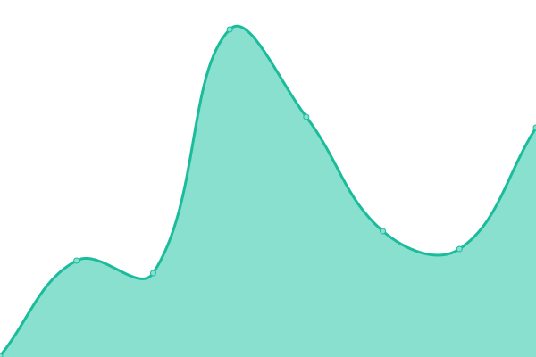
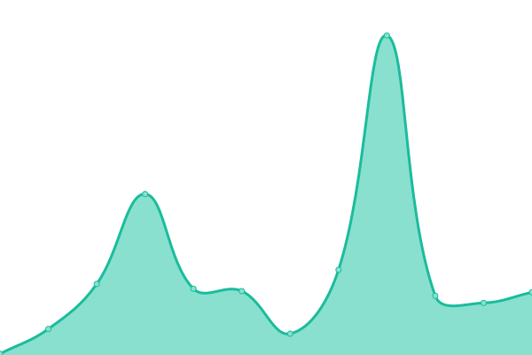
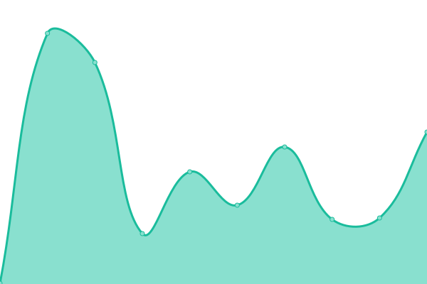
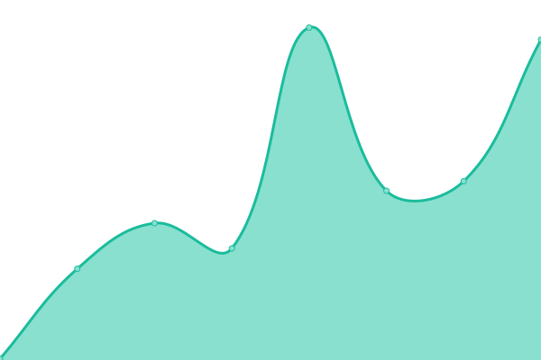

# [📈 Live Status](https://status.monago.io): <!--live status--> **🟩 All systems operational**

This repository contains the open-source uptime monitor and status page for [Monago](monago.io), powered by [Upptime](https://github.com/upptime/upptime).

With [Upptime](https://upptime.js.org), you can get your own unlimited and free uptime monitor and status page, powered entirely by a GitHub repository. We use [Issues](https://github.com/monagoio/upptime/issues) as incident reports, [Actions](https://github.com/monagoio/upptime/actions) as uptime monitors, and [Pages](https://status.monago.io) for the status page.

<!--start: status pages-->
<!-- This summary is generated by Upptime (https://github.com/upptime/upptime) -->
<!-- Do not edit this manually, your changes will be overwritten -->
<!-- prettier-ignore -->
| URL | Status | History | Response Time | Uptime |
| --- | ------ | ------- | ------------- | ------ |
|  [Monago Apps API](https://api.monago.io/app) | 🟩 Up | [monago-apps-api.yml](https://github.com/monagoio/upptime/commits/HEAD/history/monago-apps-api.yml) | 

 176ms
     
 | 

<a href="https://status.monago.io/history/monago-apps-api">100.00%</a>
    

|  [Monago Dashboard API](https://api.monago.io) | 🟩 Up | [monago-dashboard-api.yml](https://github.com/monagoio/upptime/commits/HEAD/history/monago-dashboard-api.yml) | 

 1749ms
     
 | 

<a href="https://status.monago.io/history/monago-dashboard-api">81.53%</a>
    

|  [Monago.io Sites](https://monago.io) | 🟩 Up | [monago-io-sites.yml](https://github.com/monagoio/upptime/commits/HEAD/history/monago-io-sites.yml) | 

 107ms
     
 | 

<a href="https://status.monago.io/history/monago-io-sites">99.12%</a>
    

|  [Monago Dashboard](https://cloud.monago.io) | 🟩 Up | [monago-dashboard.yml](https://github.com/monagoio/upptime/commits/HEAD/history/monago-dashboard.yml) | 

 1260ms
     
 | 

<a href="https://status.monago.io/history/monago-dashboard">99.33%</a>
    

<!--end: status pages-->

[**Visit our status website →**](https://status.monago.io)

## 📄 License

- Powered by: [Upptime](https://github.com/upptime/upptime)
- Code: [MIT](./LICENSE) © [Monago](monago.io)
- Data in the `./history` directory: [Open Database License](https://opendatacommons.org/licenses/odbl/1-0/)
